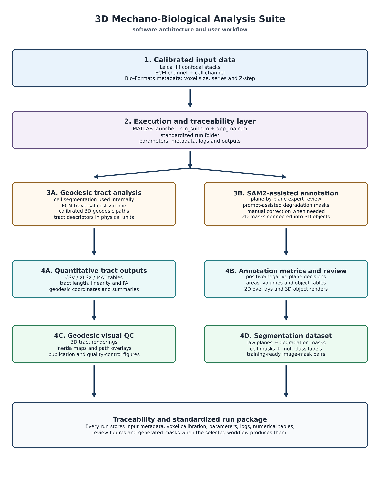

# 3D Mechano-Biological Analysis Suite

**3D Mechano-Biological Analysis Suite** is an open-source MATLAB toolkit for reproducible analysis of collagen-rich extracellular matrix (ECM) organization and remodeling in three-dimensional confocal microscopy datasets.

This public release is aligned with the SoftwareX manuscript and contains two publication-ready workflows:

| Workflow | Purpose | Main outputs |
|---|---|---|
| **Geodesic Tract Analysis** | Extract calibrated 3D intercellular ECM tracts from collagen/cell confocal stacks using collagen-derived traversal-cost maps. | 3D geodesic path renderings, path coordinates, physical tract lengths, tract-level tensor descriptors, fractional anisotropy, linearity, inertia maps, CSV/XLSX/MAT summaries and quality-control figures. |
| **SAM2-assisted Degradation and Tunnel Annotation** | Generate expert-reviewed degradation/tunnel masks using human-in-the-loop SAM2-assisted segmentation. | Raw Z-plane exports, reviewed binary masks, multiclass semantic labels, connected 3D degradation/tunnel objects, object measurements, curated image-mask pairs, overlays and reproducibility logs. |

The repository is intentionally focused. Raw microscopy datasets, heavy result folders, local Python environments, SAM2 checkpoints and under-validation routines are not included.

## Repository

Permanent repository link:

<https://github.com/davmorort1/MecBioLab-ECM-Suite>

## Workflow overview



## Tested environment

The software was developed and tested in the following environment:

- **Operating system:** Windows 11
- **MATLAB:** R2024b
- **Tested MATLAB toolboxes:**
  - Image Processing Toolbox 24.2
  - Statistics and Machine Learning Toolbox 24.2
  - Computer Vision Toolbox 24.2
  - Deep Learning Toolbox 24.2
  - Parallel Computing Toolbox 24.2
  - Medical Imaging Toolbox 24.2
  - MATLAB Compiler 24.2
  - Control System Toolbox 24.2 was installed in the development environment but is not expected to be a core dependency
- **External reader:** Bio-Formats / bfmatlab for Leica `.lif` microscopy files
- **External segmentation assistant:** SAM2, called through a local Python environment for the annotation workflow

## Quick start

1. Clone or download this repository.
2. Install MATLAB and the required toolboxes.
3. Install Bio-Formats / bfmatlab and add it to the MATLAB path.
4. Configure SAM2 if you plan to use the degradation/tunnel annotation workflow.
5. Open MATLAB in the repository root.
6. Run:

```matlab
run_suite
```

7. Select a global output folder outside the repository.
8. Launch either **Geodesic Tract Analysis** or **Degradation/Tunnel Annotation**.
9. Inspect the exported quality-control figures before interpreting quantitative tables.

## Repository layout

```text
MecBioLab-ECM-Suite/
├── README.md
├── LICENSE
├── LICENSE.txt
├── CITATION.cff
├── CHANGELOG.md
├── MANIFEST.md
├── run_suite.m
├── startup.m
├── assets/
│   └── logo.png
├── src/
│   ├── app_main.m
│   └── tools/
│       ├── geodesic_tract_analysis.m
│       ├── degradation_tunnel_annotation.m
│       ├── sam2_config.example.json
│       └── sam2_config.json
├── docs/
│   ├── INSTALLATION.md
│   ├── USER_GUIDE.md
│   ├── SAM2_SETUP.md
│   ├── OUTPUTS.md
│   ├── REPRODUCIBILITY.md
│   ├── PUBLICATION_SCOPE.md
│   └── figures/
├── data/
│   └── README.md
├── examples/
│   └── README.md
├── models/
│   └── checkpoints/README.md
├── third_party/
│   └── sam2/README.md
├── tools/
│   └── compile_standalone.m
└── results/
    └── .gitkeep
```

## Documentation

- [Installation guide](docs/INSTALLATION.md)
- [Full user guide](docs/USER_GUIDE.md)
- [SAM2 setup guide](docs/SAM2_SETUP.md)
- [Workflow outputs](docs/OUTPUTS.md)
- [Reproducibility and output policy](docs/REPRODUCIBILITY.md)
- [Publication scope](docs/PUBLICATION_SCOPE.md)

## Data and model policy

Do **not** commit raw microscopy files, local result folders, local Python environments, SAM2 checkpoints or heavy exported arrays. The `.gitignore` excludes common microscopy and model formats such as `.lif`, `.tif`, `.czi`, `.nd2`, `.ims`, `.mat`, `.h5`, `.pt`, `.pth` and `.ckpt`.

Recommended practice:

- keep raw data in private institutional storage;
- keep large result folders outside the Git repository;
- archive final code releases in Zenodo before journal submission;
- provide only lightweight example figures and documentation in GitHub.

## Citation

If you use this software, cite the associated SoftwareX article once available. Repository citation metadata are provided in [`CITATION.cff`](CITATION.cff).

## License

This project is distributed under the MIT License. See [`LICENSE`](LICENSE) and [`LICENSE.txt`](LICENSE.txt).

## Support

For questions, contact:

**David Morón Ortega**  
MecBioLab Research Group, Universidad de Sevilla  
<davmorort1@alum.us.es>
